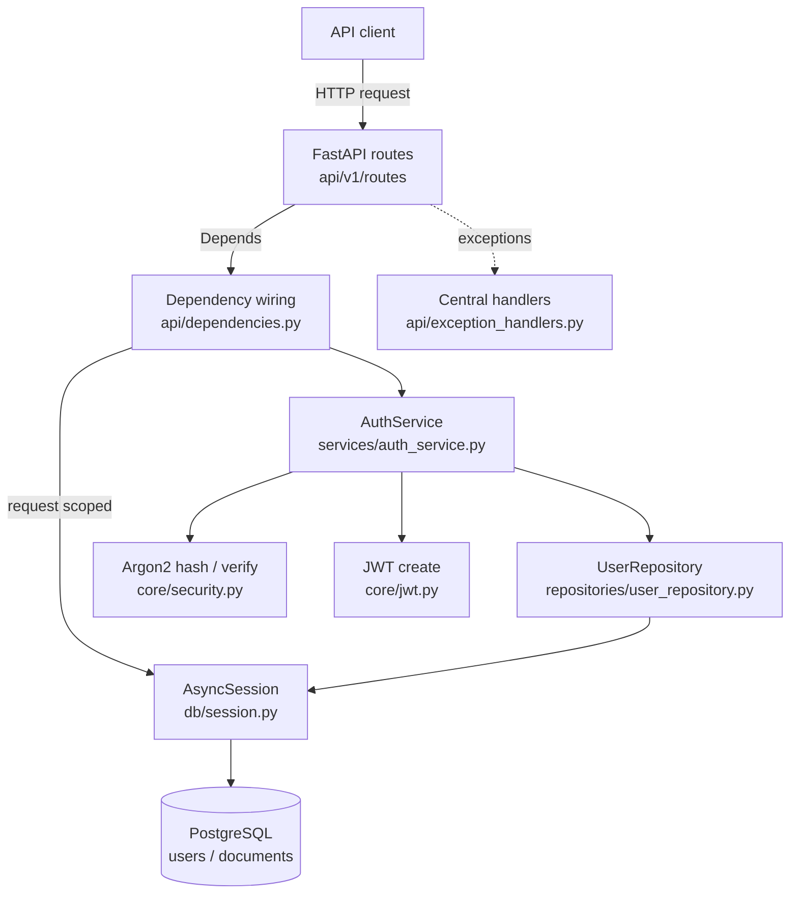
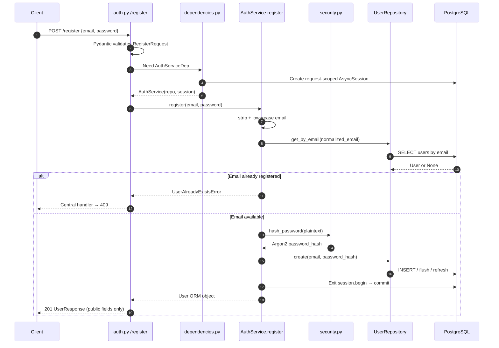
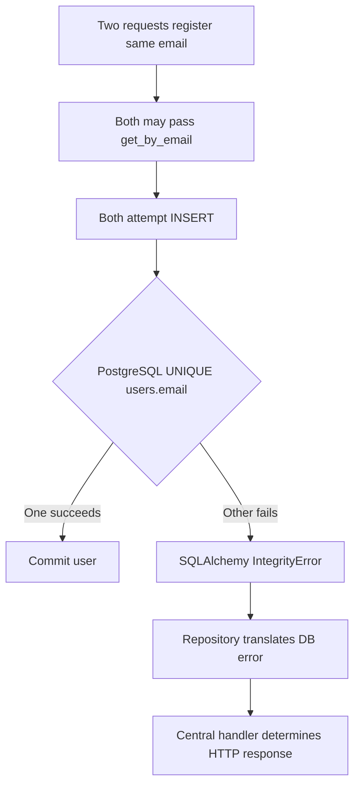
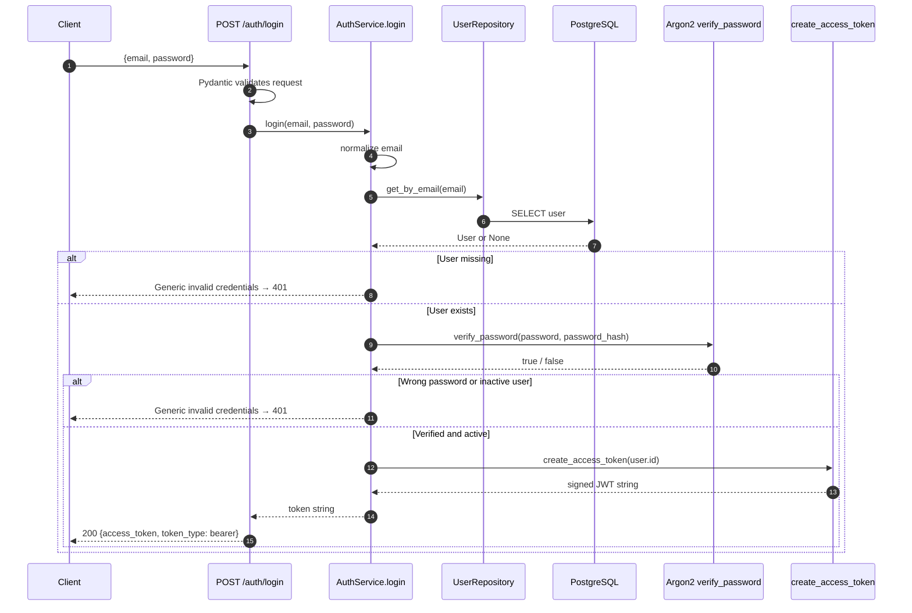
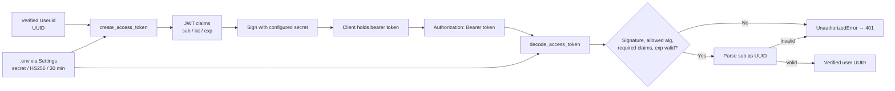
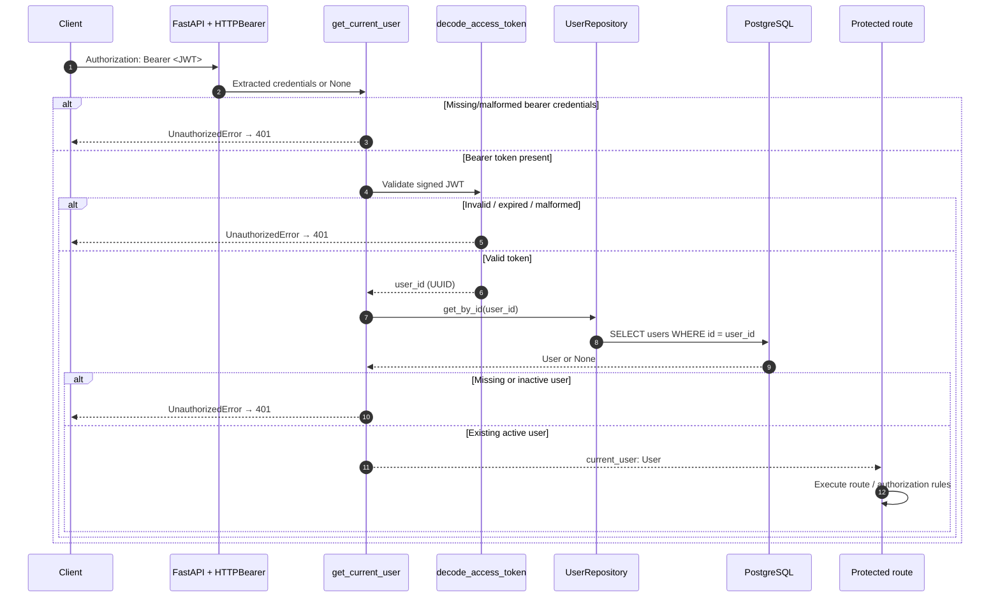
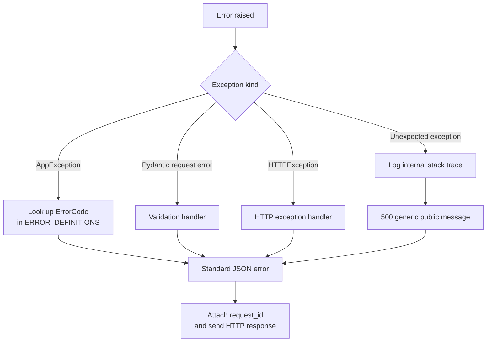
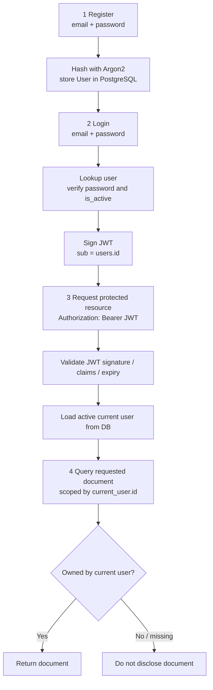

# Doc Processor — Authentication & Authorization Flow Reference

> **Purpose:** A visual, code-oriented reference for understanding the project's auth flow after time away. Read the overview, then jump to the flow or file you need.
>
> **Accuracy/status (28 Sep 2026):** The uploaded `doc-processor.zip` is an older code snapshot. Registration, user persistence, Argon2, JWT **creation**, dependency wiring, and centralized errors are directly verified in that snapshot. Login, JWT **decoding**, `get_current_user`, and document ownership were introduced or discussed later in this conversation, but their latest local implementations were **not uploaded here for inspection**. Those sections are marked **reported / intended** or **not yet verified**. Treat them as the agreed design and compare them with your local repository before relying on their exact signatures.

---

## 1. System at a glance



**Responsibility map**

| Layer | Does | Does **not** do |
|---|---|---|
| Route | Receive HTTP input, use schemas, call service, return response | SQL queries, Argon2 checks |
| Dependency | Construct service/repository; authenticate caller on protected routes | Own persistence or general business logic |
| Service | Normalize email; decide registration/login success; request JWT | Handle FastAPI HTTP responses |
| Repository | Query/create database entities | Authenticate credentials or decide document access by itself |
| `core/security.py` | Argon2 password hashing / verification | Store passwords or identify users |
| `core/jwt.py` | Create and, in the intended newer code, validate signed tokens | Check whether a user still exists or owns a document |
| PostgreSQL | Persist users/documents; enforce constraints | Infer the current user from the HTTP request |

**Three identities to keep distinct:** `users.id` is the stable database identity; JWT `sub` carries that UUID as a **string**; `current_user.id` is the verified UUID used by application authorization. Email is a login identifier, **not** an immutable user ID.

---

## 2. Registration — directly verified in uploaded snapshot

**Endpoint:** `POST /api/v1/auth/register`  
**Input:** `RegisterRequest(email: EmailStr, password: str with length 8–128)`  
**Output:** `UserResponse(id, email, is_active, created_at)` — no password or hash.



**Key code connections**

```python
# api/v1/routes/auth.py — verified pattern
user = await auth_service.register(
    email=str(request.email), password=request.password
)
return UserResponse.model_validate(user)

# services/auth_service.py — verified main flow
async with self.session.begin():
    normalized_email = email.strip().lower()
    existing_user = await self.user_repository.get_by_email(normalized_email)
    if existing_user is not None:
        raise UserAlreadyExistsError()
    password_hash = hash_password(password)
    user = await self.user_repository.create(
        email=normalized_email, password_hash=password_hash
    )
return user
```

**Why transaction + constraint both matter**



**Snapshot caveat:** In the verified ZIP, `DatabaseIntegrityError` maps to **409** through the global handler, but the repository raises it directly; a service-level translation to `UserAlreadyExistsError` for the race case is **not verified**. There is also a repository error branch that calls `self.session.rollback()` without `await`; review current local code before treating rollback hardening as finished.

---

## 3. Login — reported completed after snapshot; verify against local code

**Endpoint design:** `POST /api/v1/auth/login`  
**Input:** `LoginRequest(email: EmailStr, password: str)`  
**Output:** `TokenResponse(access_token: str, token_type: "bearer")`



**Service shape from the chat (illustrative; not independently verified in uploaded ZIP):**

```python
async def login(self, email: str, password: str) -> str:
    normalized_email = email.strip().lower()
    user = await self.user_repository.get_by_email(normalized_email)
    if user is None:
        raise InvalidCredentialsError()
    if not verify_password(password, user.password_hash):
        raise InvalidCredentialsError()
    if not user.is_active:
        raise InvalidCredentialsError()
    return create_access_token(user.id)
```

- Password comparison is against `password_hash`, **not plaintext in the DB**.
- Missing user and incorrect password return the **same** client-facing error to reduce account enumeration.
- Login does **not** reapply registration password-length rules: credential mismatch belongs to auth logic.
- Route only maps input to service and token string to `TokenResponse`; it does not query users.

---

## 4. JWT lifecycle — creation verified; validation design reported



**JWT creation in actual uploaded `core/jwt.py`:**

```python
now = datetime.now(UTC)
expires_at = now + timedelta(
    minutes=settings.jwt_access_token_expire_minutes
)
payload = {"sub": str(user_id), "iat": now, "exp": expires_at}
return jwt.encode(
    payload,
    settings.jwt_secret_key,
    algorithm=settings.jwt_algorithm,
)
```

**JWT decode/validation proposed in the conversation (verify local code):**

```python
def decode_access_token(token: str) -> UUID:
    try:
        payload = jwt.decode(
            token,
            settings.jwt_secret_key,
            algorithms=[settings.jwt_algorithm],
            options={"require": ["sub", "iat", "exp"]},
        )
        return UUID(payload["sub"])
    except (InvalidTokenError, ValueError, TypeError, AttributeError):
        raise UnauthorizedError() from None
```

| Claim / parameter | Meaning | Required behavior |
|---|---|---|
| `sub` | Subject | Stable `users.id` UUID, represented as string |
| `iat` | Issued at | Timezone-aware UTC when created; require presence |
| `exp` | Expiration | Creation time + configured TTL; reject expiry |
| Configured algorithm | Signing policy | Allow server-configured algorithm, **not** arbitrary token header algorithms |
| Secret | Signing/verification key | Loaded from environment, never hardcoded or committed |

**Do not confuse:** JWT is **signed, not encrypted**. Anyone holding it can decode the payload. Never put passwords, password hashes, credentials, or secrets inside claims. Decoding without **signature verification** is not authentication. A valid JWT proves the token checks passed, **not** that the account remains active or that any document belongs to the user.

---

## 5. Request authentication (`get_current_user`) — discussed in Step 18, unverified locally

This is how a **protected endpoint** should obtain the user. The dependency is the boundary between a bearer token and a trusted `User` ORM object.



**Dependency design provided in Step 18 (confirm that it exists in your current file):**

```python
bearer_scheme = HTTPBearer(auto_error=False)
BearerCredentials = Annotated[
    HTTPAuthorizationCredentials | None,
    Depends(bearer_scheme),
]

async def get_current_user(
    credentials: BearerCredentials,
    user_repository: UserRepositoryDep,
) -> User:
    if credentials is None:
        raise UnauthorizedError()
    user_id = decode_access_token(credentials.credentials)
    user = await user_repository.get_by_id(user_id)
    if user is None or not user.is_active:
        raise UnauthorizedError()
    return user

CurrentUserDep = Annotated[User, Depends(get_current_user)]
```

**Why query the DB after validating the JWT?** A token can remain cryptographically valid after an account is disabled or deleted. `get_current_user` must check the user's **current** database state on protected requests.

**Request-scoped wiring (DB lifecycle verified in snapshot):**

```mermaid
flowchart TB
    R[Incoming request] --> DEP[FastAPI resolves Depends]
    DEP --> DBDEP[get_db_session\nyield AsyncSession]
    DBDEP --> REP[get_user_repository\nUserRepository(session)]
    REP --> AUTH[get_auth_service\nAuthService(repo, session)]
    REP -. used directly by .-> CUR[get_current_user]
    DBDEP -. reused during request .-> CUR
    AUTH --> HAND[Auth route handler]
    CUR --> PROTECTED[Protected route handler]
    HAND --> END[Request completion]
    PROTECTED --> END
    END --> CLOSE[Session context exits / closes]
```

FastAPI constructs dependencies. The service class declares what it needs; `api/dependencies.py` decides how to provide it. Avoid creating fresh independent sessions in every helper.

---


## 6. Error path — directly verified in uploaded snapshot



**Observed mappings in snapshot**

| Situation | Exception/code | HTTP |
|---|---|---:|
| Email already registered in precheck | `UserAlreadyExistsError` / `AUTH_USER_ALREADY_EXISTS` | 409 |
| Bad login credentials (proposed login flow) | `InvalidCredentialsError` / `AUTH_INVALID_CREDENTIALS` | 401 |
| Missing/invalid auth (proposed protected flow) | `UnauthorizedError` / `AUTH_UNAUTHORIZED` | 401 |
| Invalid request schema | `VALIDATION_ERROR` | 422 |
| DB uniqueness violation raised by repository | `DatabaseIntegrityError` / `DB_INTEGRITY_ERROR` | 409 |
| Unexpected server error | `INTERNAL_ERROR` | 500 |

**Actual centralized response shape:**

```json
{
  "error": {
    "code": "AUTH_INVALID_CREDENTIALS",
    "message": "Invalid email or password.",
    "request_id": "<correlation-id>",
    "details": null
  }
}
```

`RequestIDMiddleware` reads `X-Request-ID` (or creates a UUID), stores it in `request.state.request_id`, and echoes it in the response header. The application exception handler includes it in the error body, making client reports traceable to logs. Do not log plaintext passwords or bearer tokens.

---

## 8. Operational mental model: one complete session



**Remember these invariants**

1. Never persist or return plaintext passwords; database stores only Argon2 hashes.
2. The `sub` claim uses the immutable UUID, not mutable email.
3. Verify JWT **signature**, allowed algorithm, required claims, and expiry; parse `sub` as a UUID.
4. A valid token does not override account deactivation or document ownership.
5. Trust `CurrentUserDep` for caller identity — never a client-provided `user_id` for ownership.
6. Always constrain document reads/updates/deletes to the authenticated owner and test cross-user access.
7. Route → service → repository boundaries prevent authentication and authorization logic from spreading across HTTP handlers.

---

## 9. Quick file map

| File | What to look for | Snapshot status |
|---|---|---|
| `api/v1/routes/auth.py` | `/register`; later `/login` | Register verified; login reported later |
| `schemas/auth.py` | `RegisterRequest`, `UserResponse`, `LoginRequest`, `TokenResponse` | All four schemas present in ZIP |
| `api/dependencies.py` | `DbSession`, repo/service aliases; later `HTTPBearer`, `get_current_user`, `CurrentUserDep` | Factory wiring verified; auth dependency not present in ZIP |
| `services/auth_service.py` | Register flow; later login credential checks | Register verified; login not in ZIP |
| `repositories/user_repository.py` | `get_by_email`, `get_by_id`, `create` | Verified |
| `core/security.py` | Argon2 `hash_password` and `verify_password` | Verified |
| `core/jwt.py` | `create_access_token`; later `decode_access_token` | Creation verified; decoder not in ZIP |
| `core/config.py` | Environment-backed secret, algorithm, expiry | Verified |
| `models/user.py` | Stable UUID; hash and active flag | Verified |
| `api/exception_handlers.py` | Consistent HTTP error JSON + request ID | Verified |
| `middleware/request_id.py` | Request ID lifecycle | Verified |
| `db/session.py` | Per-request async session | Verified |

